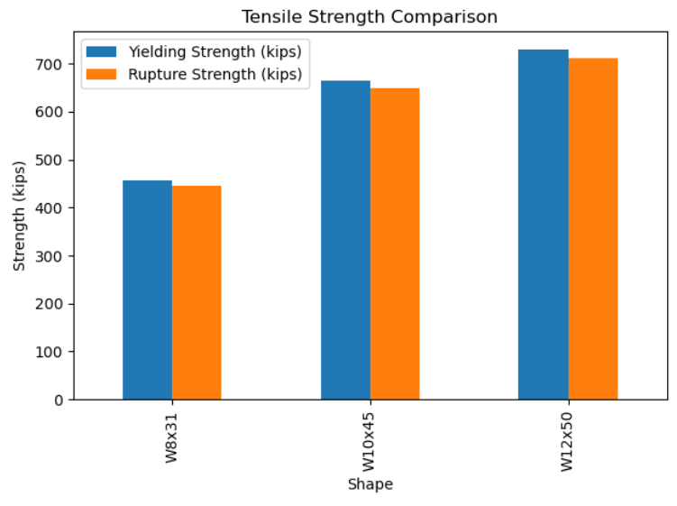

# Alex J. Kucera

Welcome to my personal website! Here you'll find information about my background, projects, and interests.

---

## About Me

I am an undergraduate student in Civil Engineering at the University of Nebraska-Lincoln.  
My engineering interests include *data analytics*, and `structural analysis`. 
Some of my other interests outside of school include traveling and golf.

---

## Skills

- Python  
- Data Visualization (Matplotlib, Seaborn)  
- Data Analysis  
- Markdown, Git, GitHub Pages
- Project Planning and Scheduling
- Structural Design
- Microsoft Office

---

## Projects

### Project 2: Structural Engineering Statics Calculations 
*In this project I created a way to analyze different types of static problems using structural analysis. Using Python I was able to streamline this process and was able to get the different forces acting on a member at it's connections.*

---

### Project 5: Automation of Steel Beam Calculations
  
*In this project I created a way to analyze tensile strength between different W-Shape steel beams. This can help speed up the design process for choosing the correct steel members when doing a design project.*

[View the code](https://github.com/yourusername/project1)

---

## Connect With Me

- [LinkedIn](https://www.linkedin.com/feed/?trk=guest_homepage-basic_nav-header-signin)  
- [GitHub](https://github.com/AlexKucera99)  
- [Email Me](mailto:alexkucera99@gmail.com)

---

